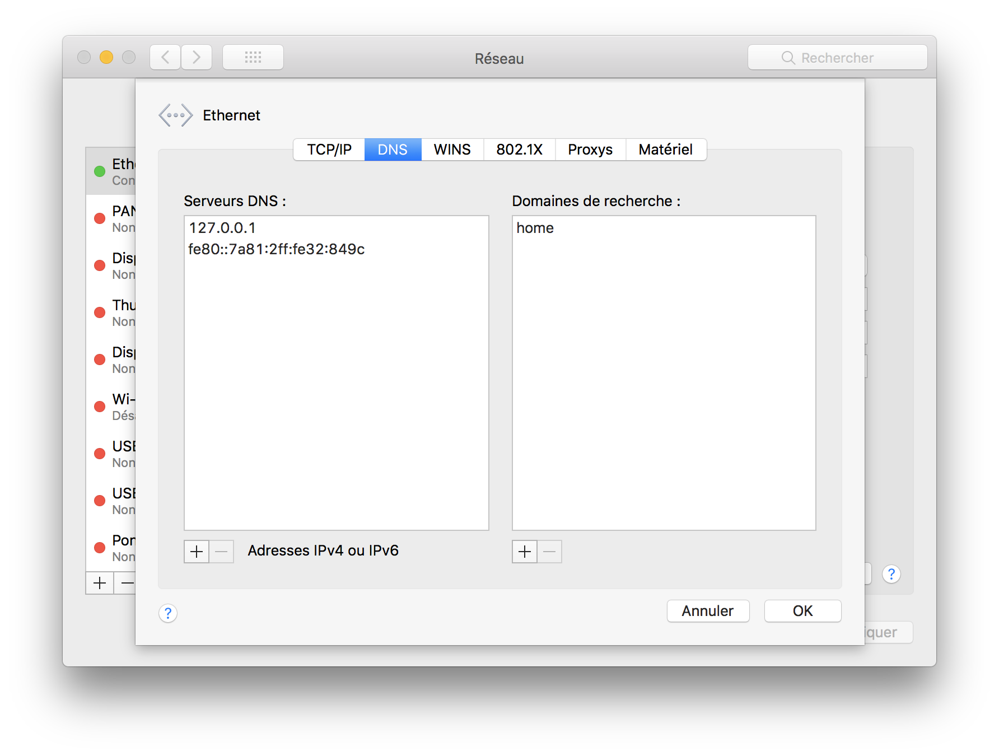

## Fresh Installation
use brew to install dnsmasq for your user

- Install dnsmasq on macOS
```sh
    brew install dnsmasq
```
- Find dnsmasq configuration file
```sh
    brew info dnsmasq
```
- Edit dnsmasq configuration, and add a line at the end of the file
```sh
    vim /usr/local/etc/dnsmasq.conf
    
    # This file will be added to the configuration
    conf-file=/Users/your_user_name/.dnsmasq/dnsmasq.conf
```
- Create a new configuration file - 
  We create a new configuration file to manage example.localhost and *.example.localhost domains.
```sh
    vim /Users/your_user_name/.dnsmasq/dnsmasq.conf
    
    # example.localhost will be resolved as 127.0.0.1, including subdomains
    address=/example.localhost/127.0.0.1
    listen-address=127.0.0.1
```
- Restart dnsmasq
```sh
    sudo brew services stop dnsmasq
    sudo brew services start dnsmasq
```
- Modify macOS network configuration - We need to tell macOS to use 127.0.0.1 as the first DNS resolver.

